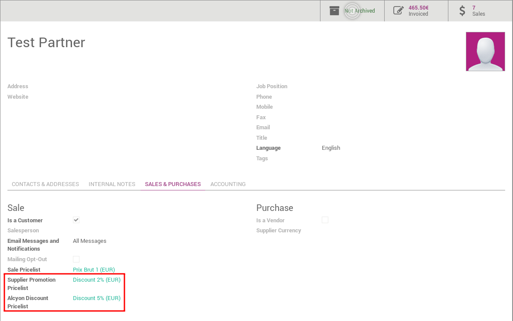
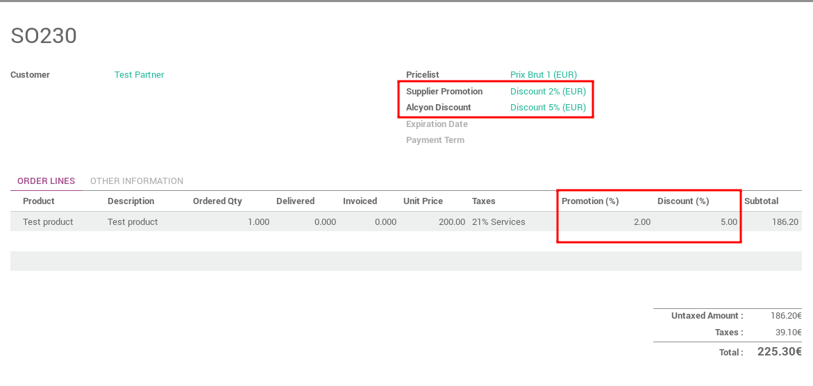

.. image:: https://img.shields.io/badge/licence-AGPL--3-blue.svg
   :target: http://www.gnu.org/licenses/agpl-3.0-standalone.html
   :alt: License: AGPL-3

==================
Discount Pricelist
==================

This module adds two promotion types on sale order and account invoice:

* Supplier promotion
* Alcyon discount pricelist

The supplier promotion is computed with promotion defined on supplierinfo.
And on the partner and the sale order, you can allow or not this computation.
The default discount pricelist to use on sale order is defined on partner.

So base pricelist contains crude price of products and Alcyon
can applied two discounts on these prices.

This module also allow to define a promotion on supplierinfo for purchase order.
And on the partner and the purchase order, you can allow or not this promotion.

Usage
=====

On partner form, sales & pruchases, you can configure new pricelists.

While creating a new quotation (sale order), you can modify theses pricelists
and view both discounts applied by pricelists on sale order lines.

Credits
=======

Contributors
------------

* Cyril Gaudin <cyril.gaudin@camptocamp.com>
* Julien Coux <julien.coux@camptocamp.com>
