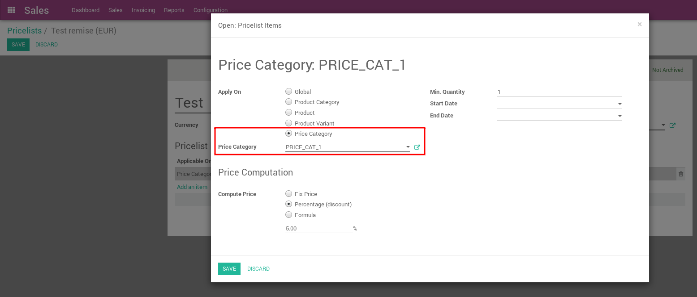
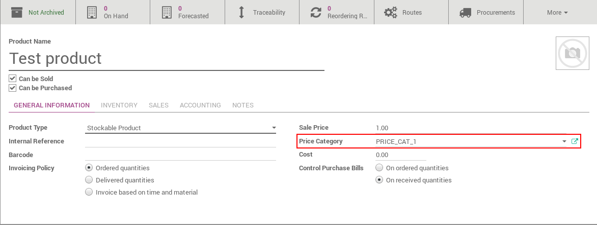

.. image:: https://img.shields.io/badge/licence-AGPL--3-blue.svg
   :target: http://www.gnu.org/licenses/agpl-3.0-standalone.html
   :alt: License: AGPL-3

======================
Product Price Category
======================

This module adds a field Price Category on Product Template
and allow Pricelist to be applied on this field.

Usage
=====

In Pricelist Form (Sales -> Configuration -> Pricelist), you can add or modify
an item ("Manage Pricelist Items" access should be checked in the user settings)
and select "Price Category" in "Applied on".
Then you have to choose on which price category should it be applied.

Product price category can be modified in product form -> General Information.

Credits
=======

Contributors
------------

* Cyril Gaudin <cyril.gaudin@camptocamp.com>
